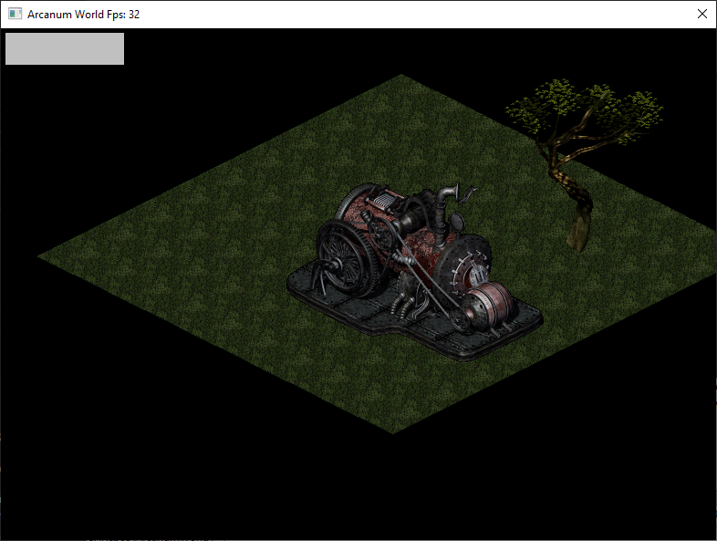
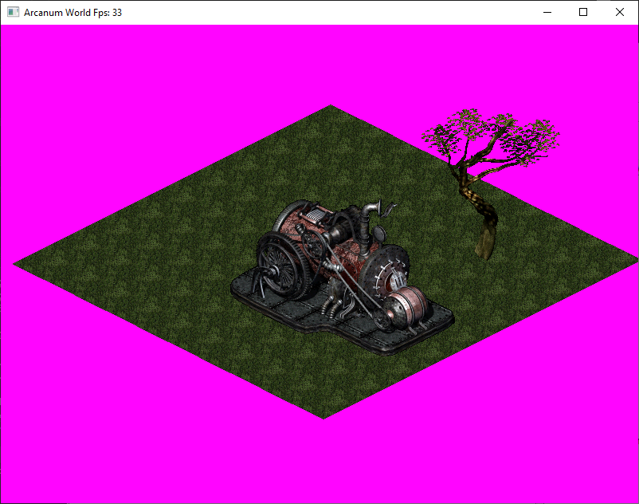

# Greetings!

A project to create an Arcanum game engine.
The project uses the LDL library.

# Install
git clone https://github.com/JordanCpp/ArcanumWorld.git
run dependencies_download
cmake CMakeLists.txt
make
Copy the game's dat files to the ArcanumWorld directory
run ArcanumWorld

# A forum for communication.
https://forums.arcanumclub.org/index.php?showtopic=12408

# Screenshots - Key W,A,S,D

# Friendly projects.
https://github.com/arcanum-project
https://github.com/OpenArcanum/artviewer
https://github.com/AxelStrem/ArtConverter
https://github.com/vleon1/Arkanum
https://github.com/iamkisly/ArcanumFileFormats